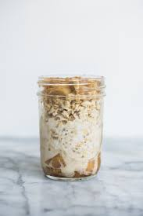
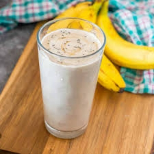

# Table of Contents
## [Overnight Apple Cinnamon Oatmeal](#overnight-apple-cinnamon-oatmeal-1)

- [Overview](#overview)

- [Ingredients](#ingredients)

- [Instructions](#instructions)

- [Warning](#warning)

## [Omelet Toast](#omelet-toast-1)

- [Overview](#overview-1)

- [Ingredients](#ingredients-1)

- [Instructions](#instructions-1)

- [Warning](#warning-1)

## [Hash Browns](#hash-browns-1)

- [Overview](#overview-2)

- [Ingredients](#ingredients-2)

- [Instructions](#instructions-2)

- [Warning](#warning-2)

## [Banana Smoothie](#banana-smoothie-1)

- [Overview](#overview-3)

- [Ingredients](#ingredients-3)

- [Instructions](#instructions-3)

- [Warning](#warning-3)

# Overnight Apple Cinnamon Oatmeal
## Overview
I have used this oats recipe ever since mom showed me it in 10th grade. It has the necessary nutrients to keep your running for the better part of the morning and will last you till lunch. Honestly this recipe is super simple and will allow you to make a batch earlier in the week and to enjoy it later in the week.
## Ingredients
- ½ cup of oats
- 1 cup of milk
- 1 apple(chopped)
- ¼ teaspoon of cinnamon
- 1 teaspoon of honey
## Instructions
1. Add quaker oats to a mason jar.
1. Pour the milk into the mason jar.
1. Finish by adding the chopped apple, cinnamon, and honey.
1. Place in the fridge for at least 8 hours and up to 72 hours.
## Warning
As this recipe calls for slicing apples, ensure that you are using the proper grip on the knife and apple to ensure that you don’t cut yourself.

# Omelet Toast
## Overview
Over the pandemic I got into cooking and wanted an easy way to make egg toast in one dish. This method was an inspiration from an egg/roti dish mom used to make me and my brother when we were kids and refused to sit and eat. It is super easy and allows for one to make everything at the same time.
## Ingredients
- 2 eggs
- 1 slice of bread
- Salt 
- Pepper
## Instructions
1. Start by adding 1 teaspoon of cooking oil to the pan.
1. Have the stove at medium to high.
1. While to pan is heating up, crack both eggs into a bowl.
1. Add half a teaspoon of salt and pepper to the bowl.
1. Whisk until the eggs are yellow.
1. Slice your bread in half down the middle.
1. Add the egg to the pan.
1. Place your now 2 slices of bread on top of the egg in the pan with half an inch of space between.
1. Once the side of the egg facing you is no longer running, flip the egg and toast.
1. After two minutes fold the sides of the egg hanging off the side of the bread in.
1. Fold the omelet in half like a sandwich.
## Warning
Since we are using a stove in this recipe ensure that you are being safe around the hot stove and pan.

# Hash Browns
## Overview
This hashbrown recipe has an Indian twist too it by utilizing the Indian spices available in the cabinets. This gives the traditional tasteless hashbrowns a completely different layer of flavor. Enjoy!
## Ingredients
- 1 large russet potato (peeled)
- ¼ cup vegetable oil
- Spices
  - Salt
  - Pepper
  - Chili Powder (Cayenne powder works too)
  - Chili flakes
## Instructions
1. Shred the potatoes with a grater.
2. Place the potato shreds into a bowl of cold water.
3. Drain the water and refill the bowl of shreds with cold water.
4. Stir the shreds in the water and drain the water.
5. Dry the potato shreds to the best of your ability.
6. Pour the vegetable oil into a nonstick pan and hat on a stove on medium high.
7. While the pan heats up, place ½ a teaspoon of salt, pepper, and chili powder.
8. Add a teaspoon of chili flakes.
9. Place the seasoned potato shreds into the hot pan and cook for 3-4 minutes.
10. Use a spatula to flip the potato shreds in sections.
11. Remove from heat and serve.
## Warning
Be careful to keep your fingers away from the grater and to be safe around the stove. 

# Banana Smoothie
## Overview
A simple, healthy, and clean drink to start of your day. This will allow you to feel healthy and clean to help clean up your digestive tract while tiding off you hunger till lunch. I used to use this drink in the mornings in high school to allow me to survive till lunch as the natural sugars from the bananas gave the needed energy to tackle the first half of the day.
## Ingredients
- 2 bananas
- 1 ½ cup milk
- 1 tablespoon peanut butter
## Instructions
1. Place the 2 bananas, split in half, into your blender
1. Add you milk.
1. Add the peanut butter.
1. Blend until smooth.
1. To add a little more texture to your smoothie I recommend slicing bananas that are slightly browned and placing them in the freezer.
## Warning
Ensure that you don’t start the blender with your hands near the blade! 

