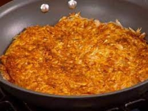

# Hash Browns

## Overview
This hashbrown recipe has an Indian twist too it by utilizing the Indian spices available in the cabinets. This gives the traditional tasteless hashbrowns a completely different layer of flavor. Enjoy!

## Ingredients
- 1 large russet potato (peeled)
- ¼ cup vegetable oil
- Spices
  - Salt
  - Pepper
  - Chili Powder (Cayenne powder works too)
  - Chili flakes

## Instructions
1. Shred the potatoes with a grater.
2. Place the potato shreds into a bowl of cold water.
3. Drain the water and refill the bowl of shreds with cold water.
4. Stir the shreds in the water and drain the water.
5. Dry the potato shreds to the best of your ability.
6. Pour the vegetable oil into a nonstick pan and hat on a stove on medium high.
7. While the pan heats up, place ½ a teaspoon of salt, pepper, and chili powder.
8. Add a teaspoon of chili flakes.
9. Place the seasoned potato shreds into the hot pan and cook for 3-4 minutes.
10. Use a spatula to flip the potato shreds in sections.
11. Remove from heat and serve.

## Warning
Be careful to keep your fingers away from the grater and to be safe around the stove. 

